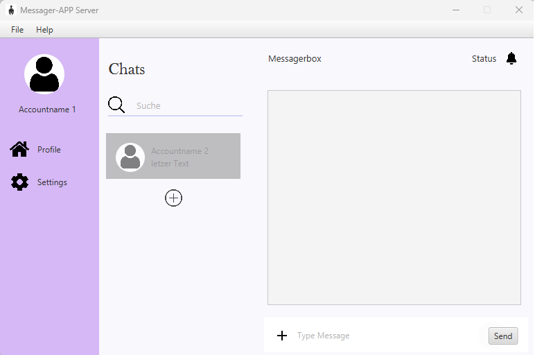

# 📱 JavaFX Messenger App – Projektdokumentation

## 1. Einführung in das Projekt

Im Rahmen dieses Projekts wird eine plattforminterne Messenger-Anwendung für die **Online Fitness GmbH** entwickelt. Das Unternehmen ist ein fiktives, aus Vorlesungen bekanntes Unternehmen, das Softwarelösungen für Fitnessstudios sowie IoT-basierte Fitnessgeräte entwickelt.

Ziel der Anwendung ist eine moderne Kommunikationslösung für die interne Firmenkommunikation, um den Austausch zwischen Mitarbeitenden effizienter und schneller zu gestalten.

Die Anwendung wird als Desktop-Software mit **JavaFX** umgesetzt und basiert auf einer **Client-Server-Architektur**.

## 2. Anforderungsanalyse

Die Messenger-App erfüllt folgende Anforderungen:

- Entwicklung einer **JavaFX Benutzeroberfläche**
- Gestaltung mit **CSS-Styling**
- Verwendung des Firmenlogos der Online Fitness GmbH als Icon
- Umsetzung einer **Client-Server-Architektur**
- Grundfunktionalität eines Messengers:
  - Senden und Empfangen von Nachrichten in Echtzeit
  - Kommunikation zwischen mehreren Clients
- Einsatz von **Multithreading**
- Netzwerkkommunikation über **Sockets (TCP/IP)**

## 3. Netzwerkprogrammierung und Java

Die Kommunikation zwischen Server und Clients erfolgt über die Java-Bibliothek `java.net`.

- Der **Server** verwaltet eingehende Verbindungen
- Die **Clients** senden und empfangen Nachrichten über den Server

Durch den Einsatz von Threads kann jede Client-Verbindung parallel verarbeitet werden, wodurch mehrere Nutzer gleichzeitig unterstützt werden.

## 4. Erläuterung: Socket

Ein **Socket** ist eine Schnittstelle für die Netzwerkkommunikation zwischen zwei Programmen.

In Java werden Sockets über folgende Klassen realisiert:

- `Socket` (Client-Seite)
- `ServerSocket` (Server-Seite)

Sockets ermöglichen eine zuverlässige, verbindungsorientierte Kommunikation über TCP/IP und sind ideal für Echtzeit-Anwendungen wie Messenger.

## 5. Architektur (MVC-Prinzip)

Die Anwendung folgt dem **Model-View-Controller (MVC)**-Prinzip:

- **Model:** Daten (Nachrichten, Benutzer)
- **View:** JavaFX Oberfläche mit CSS-Design
- **Controller:** Steuerung von Logik und Netzwerkkommunikation

Dieses Architekturmodell verbessert Wartbarkeit und Erweiterbarkeit.

## 6. Live-Präsentation der Anwendung

Die Anwendung wurde in einer Live-Demonstration in der Vorlesung vorgestellt:

- Start des Servers
- Verbindung mehrerer Clients
- Echtzeit-Nachrichtenübertragung
- Demonstration der JavaFX Oberfläche
- Erklärung der technischen Umsetzung (Sockets & Threads)

## 7. Literaturverzeichnis

- https://de.wikipedia.org/wiki/Model_View_Controller  
- https://de.wikipedia.org/wiki/Socket_(Software)  
- https://de.wikibooks.org/wiki/Java_Standard:_Socket_und_ServerSocket_(java.net)  
- https://de.wikibooks.org/wiki/Java_Standard:_Netzwerkprogrammierung  
